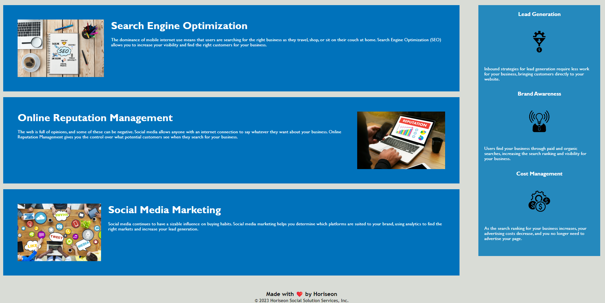

# Horiseon Website

## Description

This project involved updating the Horiseon website HTML to semantic HTML. This allows the website to meet accesibility standards and optimizes the site for search engines. 

## Usage

The Horiseon Website can is used by either clicking on a topic in the header on scroller down to read about each topic.

## Credits

Original HTML was provided https://github.com/coding-boot-camp/urban-octo-telegram

## License

Please refer to the LICENSE in the repo
